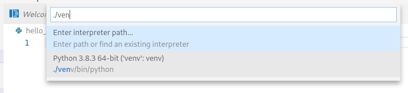
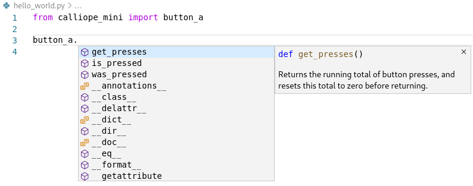
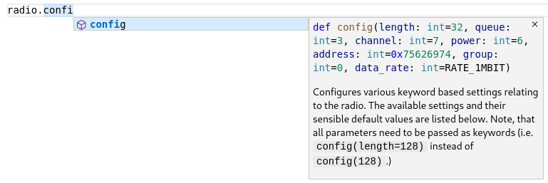

# CalliopeMini Stubs

Use this library to develop your python programs for the
[Calliope Mini](https://calliope.cc/)
using a state-of-the-art python IDE such as
[Visual Studio Code](https://code.visualstudio.com/)
on your computer.

This library only helps by providing documentation, type annotations and
function signatures.
It does not contain a simulator/emulator and it does not allow to transfer the
developed code to the Calliope Mini.

# Setup VSCode

- Install the [`ms-python.python`](https://marketplace.visualstudio.com/items?itemName=ms-python.python) extension.
- Create a
  [virtual environment](https://docs.python.org/3/tutorial/venv.html),
  via `python -m venv <name>` and activate it.
  **Note**: Make sure to install this only in a local virtual environment (and
  not system-wide) as some libraries overwrite "system" libraries and thus
  make scripts that are not intended to run on the Calliope Mini fail.
- `pip install calliope-mini-stubs` to get this package installed.
- Select the correct python (e.g. if you `pip installed` into a
  [virtual environment](https://docs.python.org/3/tutorial/venv.html),
  chose the python from there).

Now you can create a file and begin it with `from calliope_mini import display`
and upon typing `display.sh` you should see `display.show` as proposal and if
you select it the help text for `display.show`.

To make more of the extension:

- Enable Checkers `pylint` and `mypy` -- see [python linting](https://code.visualstudio.com/docs/python/linting).

## Tutorial

1. Create a virtual environment

        % python3 -m venv --system-site-packages venv

1. Activate it (`python`, `pip`, etc will be found in this directory from now on)

        % source ./venv/bin/activate

1. Verify, that you are using this virtual envirnonment -- `which python3` should generate something like this

        % which python3
        <path where you work>/venv/bin/python3

1. Install this package

        % python3 -m pip install --upgrade calliope-mini-stubs
        Looking in indexes: ....
        Collecting calliope-mini-stubs
          Downloading https://....
        Installing collected packages: calliope-mini-stubs
        Successfully installed calliope-mini-stubs-<version>

1. Launch Visual Studio Code

        % code .

1. Create a new python file, for example `hello_world.py`.
1. Make sure, that the correct interpreter is used.
   On the lower left corner of VSCode you should see the python from `venv` selected:

    

    If this is not the correct one, then select the right interpreter.
    To do so:
    - run `Ctrl + Shift + P` and type `Python: Select Interpreter`

        

    - then type `./venv/bin/python` and select that.
1. In your python file, start typing, e.g. `import calliope_mini`.
   During typing, you should already get `calliope_mini` proposed.
   [IntelliSense](https://code.visualstudio.com/docs/editor/intellisense)
   allows VSCode to give you hints on what objects/methods/... you can select in this place

    

   and VSCode can directly display the documentation for the method you currently use
   (e.g. the function signature and a human readable description)

    

# License

This package is licensed under MIT license.
See [the `LICENSE` file](LICENSE).

It uses code from the package `pseudo-microbit` which is also MIT licensed
(same as this package) with the copyright notice

    Copyright (c) 2013-2016 The MicroPython-on-micro:bit Developers, as listed
    in the accompanying AUTHORS file

# On Stub Files

Generatlly, stubs should be distributed in the form of `.pyi` files -- one
`.pyi` with documentation/typing informatino for each `.py` file.

[PEP 484](https://www.python.org/dev/peps/pep-0484/)
describes, how the `.pyi` files should look like.

[PEP 561](https://www.python.org/dev/peps/pep-0561/)
describes, how to distribute them:
- The package needs to be named `foopkg-stubs` for package `foopkg`
- A file `py.typed` must be installed in the top-level of the package.

## Problems

- pylint does not recognize `__init__.pyi` files: https://github.com/PyCQA/pylint/issues/2873
  This way, if you declare modules with interfaces only, pylint will display the error `undefined variable ...` or `no ... in module ...`.
  (vscode will correctly show the methods/docstrings/..., though!)
  -> Solution: Use `.py` files instead of `.pyi` files.
- static values such as `Image.HAPPY` are neither autocompleted nor properly
  recognized as type (i.e. `a` in `a = Image.HEART` is not detected as `Image`
  (or `MicroBitImage`)).
  If `Image` were an _instance_ it would work...
  See [the question how to get that working](https://stackoverflow.com/q/61231863/2165903).

## Working Examples for .pyi files

- https://github.com/typeddjango/django-stubs/tree/master/django-stubs
  is for https://github.com/django/django/tree/master/django
- https://github.com/mcneel/pythonstubs/tree/master/stubs/Rhino
  is for https://developer.rhino3d.com/wip/guides/rhinopython/
